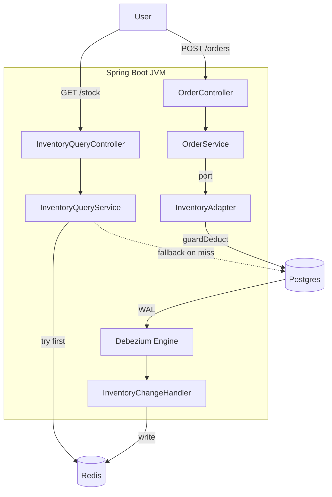

# TicketFlow

[](https://github.com/ruihanchen/TicketFlow/actions/workflows/ci.yml)

Backend for a flash-sale ticket system. The whole design is basically my answer to the 2022 Ticketmaster Taylor Swift meltdown. 14 million people tried to buy tickets at once and the site fell over. Not because 14 million purchase attempts overloaded the DB, but because every "are tickets still available?" check ran through the same code path as an actual purchase. There was nowhere cheap to send people who just wanted to find out tickets were gone.

TicketFlow splits the two paths. Stock queries hit Redis, which gets populated by CDC off the Postgres WAL (around 5ms per response). Orders go straight to Postgres through a conditional UPDATE that won't let you sell stock that isn't there. Once stock hits zero, Redis shows zero, and most clients stop trying to order. A few still sneak through during the sub-second CDC lag window, and the write path rejects those cleanly with a 409.

Java 21 · Spring Boot 3.3 · PostgreSQL 16 · Redis 7.4 · Debezium (embedded) · Micrometer / Prometheus / Grafana

## Architecture



The write path never touches Redis. A Redis outage can't cause an oversell. Whatever happens upstream, the conditional UPDATE in Postgres still runs. Debezium tails the WAL and pushes committed changes to Redis asynchronously, so the read path gets near-real-time stock without correctness depending on it.

## How the Design Got Here

I didn't start with this. Had to rewrite the inventory path a few times before it held up under load.

Started with standard JPA `@Version` optimistic locking. Correct, zero oversells ever, but at 200 concurrent writers against one hot row, 5.9% of requests hit lock conflicts and had to retry. Wasted work, and the retries made tail latency unpredictable. [Benchmark](docs/benchmarks/results/optimistic-lock-baseline-archived.md)

Replaced `@Version` with a native conditional UPDATE (`guardDeduct`): `UPDATE ... WHERE available_stock >= :quantity`. The row lock plus the WHERE clause check stock inside the lock, either commit the write or return zero affected rows. No version numbers, no retries, no conflicts. But the bottleneck didn't go away, it just moved. Once stock ran out, 36,823 sold-out requests still queued behind that same row lock to get a 409 back. The DB was doing real work to say no, 36,823 times. [Benchmark](docs/benchmarks/results/redis-down-fallback-archived.md)

Tried sticking a Redis Lua check in front of Postgres. Lua script atomically checks and decrements Redis, then writes through to the DB. Throughput jumped 2.4x because sold-out checks resolved in Redis and never opened a database connection. Numbers looked great. [Benchmark](docs/benchmarks/results/redis-lua-archived.md)

Then I found the problem with it. If the JVM died between the Redis DECRBY and the Postgres UPDATE, the two stores would diverge with no way back. The compensation in `safeReleaseStock()` only ever ran in happy-path tests. The actual crash mode (Redis wrote, DB never ran, process gone) had no recovery path at all.

Ripped the dual-write out, switched to CDC instead. Postgres is the only writer for inventory now, and Debezium tails the WAL and pushes every committed change to Redis. No window where the two stores disagree on a write, because only one of them writes at all. The 2.4x throughput I lost from the dual-write came back on the read side anyway. Stock queries serve from Redis at sub-10ms, so clients that poll before buying don't hit the write path with a doomed request.

## Design Decisions

Three of these were big enough to warrant proper write-ups. The summaries below are the *what*. The ADRs in [`docs/adr/`](docs/adr/) cover the *why*, the alternatives I considered, and the evidence.

**Inventory deduction: conditional UPDATE, not `@Version`.** `@Version` works fine in general. It just generates conflicts under contention. `guardDeduct` is one SQL per request, and the database handles serialization through its row lock. I tried `@Version` first, measured 5.9% conflicts, and switched. The old path still exists in `InventoryService.deductStock()` because `ConcurrentInventoryTest` needs the entity-level `@Version` behavior to test it directly. Production traffic never hits that path. [ADR-001](docs/adr/adr-001-conditional-update.md)

**Cache consistency: CDC, not dual-write.** The hardest lesson in the whole project. The dual-write had better raw numbers (2.4x throughput) and I shipped it. Then during an observability pass I realized the Redis vs. Postgres counter audits could silently disagree under crash conditions, and the reconciliation job could only fix undercounting, not overcounting. With CDC there's exactly one writer. If a change committed in Postgres, it reaches Redis. If it didn't commit, it doesn't. No reconciliation job, no compensation code. [ADR-002](docs/adr/adr-002-cdc-over-dual-write.md)

**Read path: Redis first, DB fallback.** A stale Redis value (user sees stock=5, DB has stock=3) is a UX problem, not a correctness one. The user might get a 409 at order time. Annoying, but caught. Going the other way (Redis says zero, DB still has stock) would mean lost sales, but with CDC lag under a second, that window is tiny in practice.

**Cross-domain boundaries: port interfaces.** The order domain depends on `InventoryPort` and `EventPort` (interfaces it defines itself), not on `InventoryService` or `EventService`. Infrastructure adapters bridge between domains. ArchUnit enforces this at build time, so a direct cross-domain service import breaks the build. I added these rules after a pre-benchmark audit turned up three violations. They exist to prevent regression, not as upfront design.

**Order state machine: PAID is terminal.** Four states. CREATED → PAYING → PAID, plus CANCELLED reachable from CREATED and PAYING. No CONFIRMED state. I thought about adding one for ticket fulfillment (QR generation, seat assignment), but TicketFlow has no fulfillment service. A state with no code path to reach it is worse than a missing state. It tells the reviewer you declared something you didn't build. CONFIRMED comes whenever fulfillment does.

**Order expiry: two independent deadlines.** A flash-sale order has two phases with different time budgets. The cart hold (how long inventory gets reserved while the user browses), and the payment window (how long the gateway gets to finish). A single `expiredAt` field couples them together. A user who clicks Pay near the cart deadline can have their payment confirmed *after* `expiredAt` has already passed. Gateway charges them, application refuses the confirmation. Two fields (`expiredAt` for cart, `paymentExpiredAt` for payment) give each phase its own deadline. [ADR-003](docs/adr/adr-003-two-tier-order-expiry.md)

## Benchmark Results

All runs: 200 VUs, 30s, 500 initial stock, same machine. Raw JSON in `docs/benchmarks/results/`.

### CDC Read Path

Does the CDC pipeline keep Redis consistent under concurrent reads and writes?

| Metric | Value |
|---|---|
| Cache hit rate | 100% |
| Read throughput | 26,105 reads/sec |
| Read latency p95 | 8.27ms |
| CDC avg lag | 0.544s |
| DB fallback | 0 |

100% hit rate, zero DB fallback. 26,105 reads per second, all from Redis. Writers changed the stock value 500 times and Redis reflected every change.

### Realistic Flash Sale

Each VU checks stock first and only places an order if stock > 0. This is the user journey Ticketmaster didn't have.

| Metric | With CDC read cache | Without (redis-down-fallback) |
|---|---|---|
| Write-path requests | 1,332 | 37,329 |
| Sold-out hitting DB | 832 | 36,823 |
| Short-circuited by cache | 947,420 (99.85%) | 0 |
| Orders sold | 500 | 500 |

The 832 sold-out requests come from the CDC lag window. A VU reads stock > 0 from Redis, but by the time the POST lands, another VU already grabbed the last ticket. I thought this number would be way higher. Maybe 5,000. Under 1,000 means the lag window rarely lines up with the race window in practice.

### Flash Sale Spike

`ramping-arrival-rate` executor (open model: iterations fire regardless of server latency, like real users mashing the buy button). Baseline → instant spike to 150 RPS → sustain 90s → recovery.

| Metric | Value |
|---|---|
| Oversell audit | ALL_SOLD (500 sold + 0 remaining = 500) |
| Soldout latency p95 | 5.45ms |
| Hard errors | 0 |

The correctness invariant is `order_success + remaining_stock == INITIAL_STOCK`. If that breaks, `guardDeduct` has a bug. It held.

### Crash Convergence

Does Redis actually converge to Postgres state after a mid-flight JVM crash?

| Phase | Postgres | Redis | Delta |
|---|---|---|---|
| Before crash | 4720 | 4521 | -199 (normal CDC lag) |
| After crash | 4370 | 4395 | +25 (Redis ahead, diverged) |
| After CDC replay | 4370 | 4370 | 0 (converged) |

I killed the JVM mid-run with writes still in flight. On restart, Debezium picked up from the last acknowledged LSN, replayed the retained WAL, and Redis converged on its own. No manual intervention. [Full procedure and screenshots](docs/benchmarks/results/cdc-read-cache.md#crash-convergence)

## Project Structure

```
app/src/main/java/com/chendev/ticketflow/
├── order/            # the hot path: state machine, deadlines, idempotency
│   ├── entity/
│   ├── statemachine/
│   ├── port/         # EventPort, InventoryPort (defined by order, implemented by adapters)
│   ├── service/      # OrderService, OrderTimeoutService (the reaper)
│   └── factory/      # OrderNoFactory (UUIDv7)
├── event/            # event + ticket type CRUD, publish
│   └── port/         # InventoryInitPort
├── inventory/        # guardDeduct lives here, plus the CDC read cache
│   ├── port/
│   ├── redis/        # RedisInventoryManager (read-only), InventoryRedisKeys
│   └── metrics/
├── infrastructure/   # adapters, CDC engine, security config
│   ├── adapter/      # bridges between domains (the only package that imports across them)
│   └── cdc/          # Debezium setup + InventoryChangeHandler
├── security/         # JWT, cross-cutting rather than a domain
├── user/
└── common/           # DomainException, ResultCode
```

## Running Locally

**One command** (requires Docker):

```bash
docker compose up -d
```

This builds the app from source, starts Postgres, Redis, Prometheus, and Grafana. First run takes a few minutes to download Maven dependencies; subsequent builds use the Docker cache. The app is at `localhost:8080`, Grafana at `localhost:3000`.

**For development** (run app on host, faster reload):

```bash
docker compose up -d postgres redis    # infrastructure only
./mvnw spring-boot:run -pl app
```

Tests (Testcontainers; does not need `docker compose`):

```bash
./mvnw test -pl app
```

Admin setup (one time): register a user via `POST /api/v1/auth/register`, then `UPDATE users SET role='ADMIN' WHERE username='...'` from psql.

Benchmarks need [k6](https://k6.io/docs/get-started/installation/):

```bash
k6 run docs/benchmarks/scripts/cdc-read-path.js
k6 run docs/benchmarks/scripts/flash-sale-realistic.js
k6 run docs/benchmarks/scripts/flash-sale-spike.js
```

Reset between runs: `psql -f docs/benchmarks/scripts/k6-cleanup.sql` and restart the app to clear in-memory Prometheus counters.

## Tests

15 test classes. The ones worth reading first.

`ConcurrentInventoryTest`. 200 threads buy from 50 tickets. After all threads finish, sold + remaining = 50, every time. Unit-level proof that `guardDeduct` doesn't oversell.

`IdempotencyTest`. Same `requestId` submitted by 50 concurrent threads. Exactly one order gets created. The rest hit either the fast path (`findByRequestId`) or the unique constraint at the DB.

`InventoryCdcSyncTest`. Writes to Postgres, polls Redis until the new value shows up. End-to-end proof the CDC pipeline works in Testcontainers.

`ArchitectureTest`. Four ArchUnit rules that fail the build on cross-domain dependencies. They exist because I found three violations during a code audit and don't want them back.

Full list: `ConcurrentInventoryTest`, `IdempotencyTest`, `OrderStateMachineTest`, `OrderTimeoutTest`, `OrderConcurrencyRaceTest`, `ExpiredOrderRejectionTest`, `InventoryCdcSyncTest`, `RedisInventoryTest`, `InventoryQueryServiceTest`, `InventoryQueryServiceFallthroughTest`, `InsufficientStockCounterTest`, `ArchitectureTest`, `OrderNoFactoryTest`, `ResultCodeTest`, `SmokeTest`.

## What's Still Missing

A few things I'd want to have if this were actually going to production.

The main one is a **virtual queue** in front of the write path, capping how many users can reach checkout at once. Even with the read cache absorbing 99.85% of sold-out traffic, a real sale with millions of users needs admission control. Otherwise the initial surge overwhelms everything before stock has a chance to deplete. That's the layer that would have prevented Ticketmaster's cascade even without a read cache, and honestly it's a bigger lever than anything in the current design.

**Real payment processing.** Right now the `PAYMENT_FAIL` event label is wired into the state machine but nothing triggers it, because there's no gateway. Stripe webhook integration is the obvious thing to plug in.

**A CONFIRMED state** for ticket fulfillment (QR generation, seat assignment). Not in the current state machine because there's no fulfillment service to drive the transition, and declaring a state with no code path to reach it is worse than not having it.